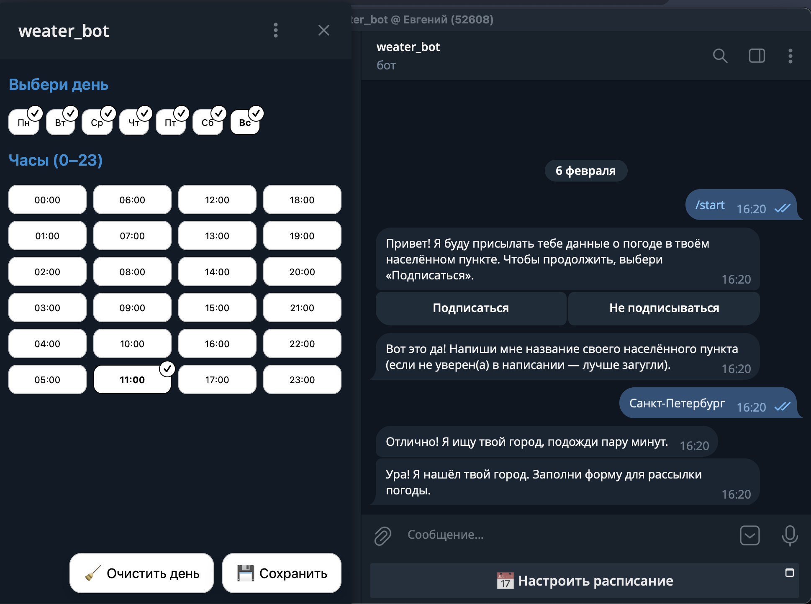
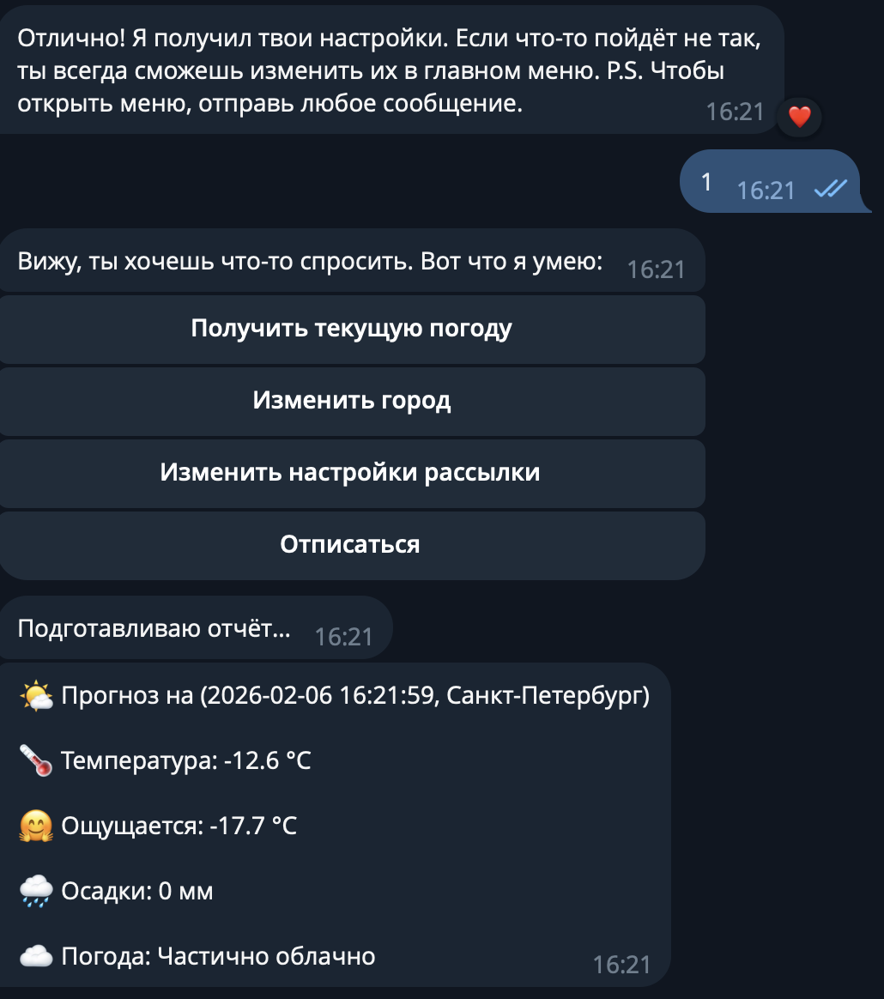

## Описание проекта

**Weather Telegram Bot** – это Telegram‑бот, который:
- определяет город пользователя по текстовому вводу через геодекодер
- получает прогноз погоды из Open‑Meteo
- позволяет подписаться на ежедневную рассылку
- настраивать дни недели и время отправки через Telegram WebApp
- запрашивать текущую погоду по команде

___
## Ссылка на бот:
https://t.me/weather_pupu_bot

## Пример работы бота


---

## Что нужно для запуска

- **Docker + Docker Compose**

---

## Инструкция для запуска

### 1. Установить проект
```bash
git clone git@github.com:Evgeniy-d3v/weather.git
cd weather
```

___

### 2. Собрать образы Docker
```bash
docker compose up -d --build
```

___

### 3. Создать Telegram‑бота
1. Найти бота **@BotFather** в Telegram
2. Отправить `/newbot` и следовать инструкциям
3. Получить токен и username
4. Добавить в `.env`:
```env
TELEGRAM_BOT_TOKEN=ваш_токен
TELEGRAM_BOT_USERNAME=ваш_username
```

___

### 4. Получить API‑ключ от geocode.maps.co
1. Зарегистрироваться на https://geocode.maps.co/
2. Получить API‑ключ
3. Добавить в `.env`:
```env
GEO_DECODING_API_KEY=ваш_ключ
```

___

### 5. Настроить .env
Создать `.env` из примера:
```bash
cp .env.example .env
```

Заполнить обязательные переменные:
```env
APP_URL=https://your-domain.com
TELEGRAM_BOT_TOKEN=...
TELEGRAM_BOT_USERNAME=...
GEO_DECODING_API_KEY=...

# База данных (по умолчанию для Docker)
DB_CONNECTION=mysql
DB_HOST=mysql
DB_DATABASE=weather_bot
DB_USERNAME=laravel
DB_PASSWORD=laravel

# Redis
REDIS_HOST=weather-redis

# RabbitMQ
QUEUE_CONNECTION=rabbitmq
RABBITMQ_HOST=weather-rabbitmq
RABBITMQ_USER=admin
RABBITMQ_PASSWORD=admin
```

___

### 6. Выполнить миграции
```bash
docker compose exec php php artisan migrate --force
```

___

### 7. Установить вебхук Telegram
```bash
docker compose exec php php artisan telegram:set-webhook
```

По умолчанию вебхук установится на `APP_URL/api/telegram/webhook`

---

## Стек технологий

- **PHP 8.2** + **Laravel 12**
- **Telegram Bot SDK** (`irazasyed/telegram-bot-sdk`)
- **Open‑Meteo** (`php-weather/open-meteo`) – прогноз погоды
- **Geocoder** (`willdurand/geocoder`) – геодекодер
- **MySQL 8** – база данных
- **Redis** – кеш
- **RabbitMQ** – очереди
- **Nginx** – веб‑сервер
- **Docker Compose** – оркестрация

**Очереди:**
- `handle_telegram_webhook` – обработка вебхуков
- `send_telegram_message` – отправка сообщений
- `get_city_coordinate` – получение координат
- `daily_forecast` / `hourly_forecast` – прогнозы
- `send_forecast_report` / `send_current_weather` – рассылка

**Планировщик:**
- `php artisan schedule:work` – ежечасный запуск команд обновления и рассылки

---

## Локальный запуск (без Docker)

1. Установить зависимости:
```bash
composer install
npm install
```

2. Создать `.env` и заполнить (см. выше)

3. Запустить:
```bash
php artisan key:generate
php artisan migrate
composer dev
```

Не забудьте получить HTTPS сертификаты и запустить MySQL, Redis и RabbitMQ отдельно.
